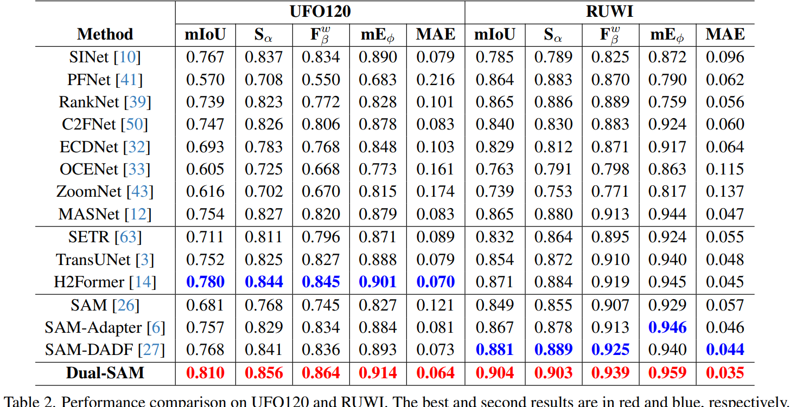

<div align="center">
<h1>Dual-SAM [CVPR2024-Highlight]</h1>
<h3>Fantastic Animals and Where to Find Them: Segment Any Marine Animal with Dual SAM</h3>

[*Pingping Zhang✉️](http://faculty.dlut.edu.cn/zhangpingping/en/index.htm)<sup>1</sup>,[Tianyu Yan](https://github.com/Drchip61)<sup>1</sup>,[Yang Liu](http://faculty.dlut.edu.cn/liuyang1/zh_CN/index.htm)<sup>1</sup>, [Huchuan Lu](http://faculty.dlut.edu.cn/Huchuan_Lu/zh_CN/index.htm)<sup>1</sup>

[Dalian University of Technology, IIAU-Lab](https://futureschool.dlut.edu.cn/IIAU.htm)<sup>1</sup>


## Abstract

As an important pillar of underwater intelligence, Marine Animal Segmentation (MAS) involves segmenting animals within marine environments. Previous methods don't excel in extracting long-range contextual features and overlook the connectivity between pixels. Recently, Segment Anything Model (SAM) offers a universal framework for general segmentation tasks. Unfortunately, trained with natural images, SAM does not obtain the prior knowledge from marine images. In addition, the single-position prompt of SAM is very insufficient for prior guidance. To address these issues, we propose a novel learning framework, named Dual-SAM for high-performance MAS. To this end, we first introduce a dual structure with SAM's paradigm to enhance feature learning of marine images. Then, we propose a Multi-level Coupled Prompt (MCP) strategy to instruct comprehensive underwater prior information, and enhance the multi-level features of SAM's encoder with adapters. Subsequently, we design a Dilated Fusion Attention Module (DFAM) to progressively integrate multi-level features from SAM's encoder. With dual decoders, it generates pseudo-labels and achieves mutual supervision for harmonious feature representations. Finally, instead of directly predicting the masks of marine animals, we propose a Criss-Cross Connectivity Prediction (
C3P) paradigm to capture the inter-connectivity between pixels. It shows significant improvements over previous techniques. Extensive experiments show that our proposed method achieve state-of-the-art performances on five widely-used MAS datasets.
## Overview

* [**Dual-SAM**] is a novel learning framework for high performance Marine Animal Segmentation (MAS). The framework inherits the ability of SAM and adaptively incorporate prior knowledge of underwater scenarios.

<p align="center">
  
</p>

* **Motivation of Our proposed Mehtod**

<p align="center">
  
</p>

* **Multi-level Coupled Prompt**

<p align="center">
  
</p>

* **Criss-Cross Connectivity Prediction**

<p align="center">
  
</p>

* **Dilated Fusion Attention Module**

<p align="center">
  
</p>


## Main Results

We rely on five public datasets and five evaluation metrics to thoroughly validate our model’s performance.
<p align="center">
  
</p>

<p align="center">
  
</p>


## Getting Started

</div>

### Installation

**step1:Clone the Dual_SAM repository:**

To get started, first clone the Dual_SAM repository and navigate to the project directory:

```bash
git clone https://github.com/Drchip61/Dual_SAM.git
cd Dual_SAM

```

**step2:Environment Setup:**

Dual_SAM recommends setting up a conda environment and installing dependencies via pip. Use the following commands to set up your environment:
#### Create and activate a new conda environment

```bash
conda create -n Dual_SAM
conda activate Dual_SAM
```
#### Install Dependencies.
```bash
pip install -r requirements.txt
```

#### Download pretrained model.
Please put the pretrained [SAM model](https://drive.google.com/file/d/1_oCdoEEu3mNhRfFxeWyRerOKt8OEUvcg/view?usp=share_link) in the Dual-SAM file.

### Model Training and Testing

**Training**
```bash
# Change the hyper parameter in the train_s.py 
python train_s.py
```

**Testing**
```bash
# Change the hyper parameter in the test_y.py 
python test_y.py
```

### Analysis Tools


```bash
# First threshold the prediction mask
python bimap.py
# Then evaluate the perdiction mask
python test_score.py
```

### Visual Results
We provide our [predicted results](链接：https://pan.baidu.com/s/18p7qFOC_J3GGz1QherHyMQ?pwd=qi0f 
提取码：qi0f) in the following attachment.

We also provide USOD10K dataset [predicted results](链接：https://pan.baidu.com/s/1ZjV65Gh5_86y2nEdV6VBeA?pwd=ii60 
提取码：ii60) in the following attachment. 


### Concat
If you have any question, please contact at 2981431354@qq.com!

## Citation

```
@inproceedings{
anonymous2024fantastic,
title={Fantastic Animals and Where to Find Them: Segment Any Marine Animal with Dual {SAM}},
author={Pingping Zhang，Tianyu Yan， Yang Liu，Huchuan Lu},
booktitle={Conference on Computer Vision and Pattern Recognition 2024},
year={2024}
}
```
