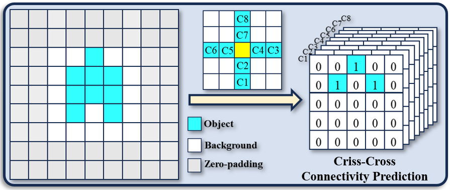

<div align="center">
<h1>Dual-SAM </h1>
<h3>Fantastic Animals and Where to Find Them: Segment Any Marine Animal with Dual SAM</h3>

[Pingping Zhang*](http://faculty.dlut.edu.cn/zhangpingping/en/index.htm)<sup>1</sup>,[Tianyu Yan](https://github.com/Drchip61)<sup>1</sup>,[Yang Liu](http://faculty.dlut.edu.cn/liuyang1/zh_CN/index.htm)<sup>1</sup>, [Huchuan Lu](http://faculty.dlut.edu.cn/Huchuan_Lu/zh_CN/index.htm)<sup>1</sup>

[Dalian University of Technology, IIAU-Lab](https://futureschool.dlut.edu.cn/IIAU.htm)<sup>1</sup>


## Abstract

As an important pillar of underwater intelligence, Marine Animal Segmentation (MAS) involves segmenting animals within marine environments. Previous methods don't excel in extracting long-range contextual features and overlook the connectivity between pixels. Recently, Segment Anything Model (SAM) offers a universal framework for general segmentation tasks. Unfortunately, trained with natural images, SAM does not obtain the prior knowledge from marine images. In addition, the single-position prompt of SAM is very insufficient for prior guidance. To address these issues, we propose a novel learning framework, named Dual-SAM for high-performance MAS. To this end, we first introduce a dual structure with SAM's paradigm to enhance feature learning of marine images. Then, we propose a Multi-level Coupled Prompt (MCP) strategy to instruct comprehensive underwater prior information, and enhance the multi-level features of SAM's encoder with adapters. Subsequently, we design a Dilated Fusion Attention Module (DFAM) to progressively integrate multi-level features from SAM's encoder. With dual decoders, it generates pseudo-labels and achieves mutual supervision for harmonious feature representations. Finally, instead of directly predicting the masks of marine animals, we propose a Criss-Cross Connectivity Prediction (
C3P) paradigm to capture the inter-connectivity between pixels. It shows significant improvements over previous techniques. Extensive experiments show that our proposed method achieve state-of-the-art performances on five widely-used MAS datasets.
## Overview

* [**Dual-SAM**] is a novel learning framework for high performance Marine Animal Segmentation (MAS). The framework inherits the ability of SAM and adaptively incorporate prior knowledge of underwater scenarios.

<p align="center">
  
</p>

* **Motivation of Our proposed Mehtod**

<p align="center">
  
</p>

* **Multi-level Coupled Prompt**

<p align="center">
  
</p>

* **Criss-Cross Connectivity Prediction**

<p align="center">
  
</p>

* **Dilated Fusion Attention Module**

<p align="center">
  
</p>

## Main Results

We rely on five public datasets and five evaluation metrics to thoroughly validate our model’s performance.
<p align="center">
  
</p>

<p align="center">
  
</p>


## Getting Started

### Installation

**step1:Clone the VMamba repository:**

To get started, first clone the VMamba repository and navigate to the project directory:

```bash
git clone https://github.com/MzeroMiko/VMamba.git
cd VMamba

```

**step2:Environment Setup:**

VMamba recommends setting up a conda environment and installing dependencies via pip. Use the following commands to set up your environment:
#### Create and activate a new conda environment

```bash
conda create -n vmamba
conda activate vmamba
```
#### Install Dependencies.
```bash
pip install -r requirements.txt
# Install selective_scan and its dependencies
cd selective_scan && pip install . && pytest
```


Optional Dependencies for Model Detection and Segmentation:
```bash
pip install mmengine==0.10.1 mmcv==2.1.0 opencv-python-headless ftfy
pip install mmdet==3.3.0 mmsegmentation==1.2.2 mmpretrain==1.2.0
```

### Model Training and Inference

**Classification:**

To train VMamba models for classification on ImageNet, use the following commands for different configurations:

```bash
# For VMamba Tiny
python -m torch.distributed.launch --nnodes=1 --node_rank=0 --nproc_per_node=8 --master_addr="127.0.0.1" --master_port=29501 main.py --cfg configs/vssm/vssm_tiny_224.yaml --batch-size 128 --data-path /dataset/ImageNet2012 --output /tmp

# For VMamba Small
python -m torch.distributed.launch --nnodes=1 --node_rank=0 --nproc_per_node=8 --master_addr="127.0.0.1" --master_port=29501 main.py --cfg configs/vssm/vssm_small_224.yaml --batch-size 128 --data-path /dataset/ImageNet2012 --output /tmp

# For VMamba Base
python -m torch.distributed.launch --nnodes=1 --node_rank=0 --nproc_per_node=8 --master_addr="127.0.0.1" --master_port=29501 main.py --cfg configs/vssm/vssm_base_224.yaml --batch-size 128 --data-path /dataset/ImageNet2012 --output /tmp

```

**Detection and Segmentation:**

For detection and segmentation tasks, follow similar steps using the appropriate config files from the `configs/vssm` directory. Adjust the `--cfg`, `--data-path`, and `--output` parameters according to your dataset and desired output location.

### Analysis Tools

VMamba includes tools for analyzing the effective receptive field, FLOPs, loss, and scaling behavior of the models. Use the following commands to perform analysis:

```bash
# Analyze the effective receptive field
CUDA_VISIBLE_DEVICES=0 python analyze/get_erf.py > analyze/show/erf/get_erf.log 2>&1

# Analyze FLOPs
CUDA_VISIBLE_DEVICES=0 python analyze/get_flops.py > analyze/show/flops/flops.log 2>&1

# Analyze loss
CUDA_VISIBLE_DEVICES=0 python analyze/get_loss.py

# Further analysis on scaling behavior
python analyze/scaleup_show.py

```

## Star History

[](https://star-history.com/#MzeroMiko/VMamba&Date)

## Citation

```
@article{liu2024vmamba,
  title={VMamba: Visual State Space Model},
  author={Liu, Yue and Tian, Yunjie and Zhao, Yuzhong and Yu, Hongtian and Xie, Lingxi and Wang, Yaowei and Ye, Qixiang and Liu, Yunfan},
  journal={arXiv preprint arXiv:2401.10166},
  year={2024}
}
```

## Acknowledgment

This project is based on Mamba ([paper](https://arxiv.org/abs/2312.00752), [code](https://github.com/state-spaces/mamba)), Swin-Transformer ([paper](https://arxiv.org/pdf/2103.14030.pdf), [code](https://github.com/microsoft/Swin-Transformer)), ConvNeXt ([paper](https://arxiv.org/abs/2201.03545), [code](https://github.com/facebookresearch/ConvNeXt)), [OpenMMLab](https://github.com/open-mmlab),
and the `analyze/get_erf.py` is adopted from [replknet](https://github.com/DingXiaoH/RepLKNet-pytorch/tree/main/erf), thanks for their excellent works.

* We release [Fast-iTPN](https://github.com/sunsmarterjie/iTPN/tree/main/fast_itpn) recently, which reports the best performance on ImageNet-1K at Tiny/Small/Base level models as far as we know. (Tiny-24M-86.5%, Small-40M-87.8%, Base-85M-88.75%)
